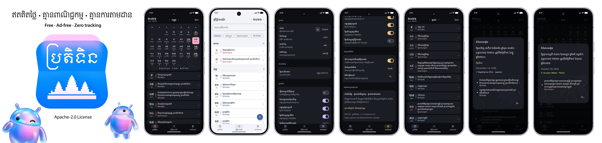

<div align="center">


# Khmer Calendar

[-3DDC84?logo=android&logoColor=white)](https://developer.android.com/)
[](https://kotlinlang.org/)
[](https://developer.android.com/jetpack/compose)
[](docs/architecture.md)
[](docs/architecture.md)
<!-- [](LICENSE) -->

A fast, privacy-first, ad-free Android calendar application engineered with native Kotlin and Jetpack Compose. Seamlessly converts between Gregorian dates and traditional Khmer lunar dates (*Chhankitek*), computes Buddhist Era chronology and astronomical transitions, provides verified Cambodian public holidays and cultural observances, and offers customizable local notifications.

**[Live Web (PWA) Calendar](https://rsg-kh.github.io/khmer-calendar-pwa/)** — Open the web version in your browser on phones, tablets, and desktops.

</div>



## Key Features

### 📅 Traditional Khmer Lunar Engine (1800–2200)
- **Four Centuries of Accuracy**: Computes Khmer lunar dates, waxing/waning moon cycles (*Koeut / Roach*), leap months (*Adhikamasa*), and leap days (*Chhantrea Adhikavara*) across all 146,462 days from 1800 to 2200.
- **Accurate Astronomical Year Transitions**:
  - **Animal Year (Zodiac)**: Transitions precisely at the arrival moment of **Moha Songkran** in mid-April.
  - **Sak**: Increments at **Lerng Sak** (the culmination of the New Year festival).
  - **Buddhist Era (BE)**: Increments strictly on **1 Roach Pisakh** (following Visak Bochea), adhering to traditional civil calculation.
- **Western Zodiac Integration**: Calculates astrological signs, elements, and ruling celestial bodies alongside the Khmer lunar calendar.

### 🌸 Buddhist Holy Days (*Thngai Seil*)
- Accurately tracks the 8th and 15th waxing days, and 8th and 14th/15th waning days (including 29-day month boundary adjustments).
- Identifies Shaving Day (*Thngai Kaor*), the day immediately preceding each holy day.
- Elegant semi-transparent lotus artwork (25% opacity, full cell scale) adorns holy day cells in the calendar grid.
- Independent visibility toggles allow users to show or hide holy day markers in the calendar grid and event lists.

### 🏛️ Curated Event Database & Recurrence Rules
- **Bundled Reference Database**: Contains **3,246 verified event occurrences** for 2000–2030 from reference archives.
- **Official Government Holidays**: Public holiday markers are cross-referenced and validated against official Ministry of Economy and Finance (MEF) and Legal Reform Committee (LRC) gazettes.
- **Historical & Cultural Recurrences (1800–2200)**: 100 reviewed rules calculate traditional festivals (Water Festival, Pchum Ben, Royal Ploughing, Meak Bochea, Visak Bochea, Khmer New Year) and national/UN observances outside the primary reference window.

### ⏰ Custom Events & Precision Notifications
- **Local SQLite Persistence**: Create, edit, and delete personal events with titles, dates, times, and notes.
- **Time Zone Intelligence**:
  - **Local Time**: Follows device time zone changes during travel and daylight saving time.
  - **Cambodia Time (UTC+7)**: Option to fix calculations to Cambodia time regardless of location.
- **Local Alarms**: Powered by Android's `AlarmManager.setExactAndAllowWhileIdle`—delivers notifications reliably without background battery drain or remote push servers.
- **Flexible Repeat Intervals**: Configure daily push times with repeat reminders set to **Off**, 2, 4, 6, 8, or 12 hours.

### 📱 Adaptive Multi-Form-Factor UI
- **Phone Landscape Experience**: Navigation rail tabs dynamically expand across the entire vertical height (`weight(1f)`), delivering ergonomic tap targets without empty dead space.
- **Tablet Landscape 2-Column Layout**: Left column features the month grid and a consolidated 2-column lunar and Gregorian date card, leaving the right column for full-month event browsing.
- **Responsive Month Picker**: Jump between months with a 6-column by 2-row layout in landscape mode.
- **Intelligent Scrollbars**: Clean, canvas-based vertical scrollbars appear strictly when content overflows dialog containers.
- **Optical Geometry Balancing**: Event markers (holiday circles, holy day triangles, observance squares) are normalized by minimum dimension for uniform visual balance.

### 🎨 Personalization & Accessibility
- **Curated Theme Accents**: Choose from **Blue** (Default), **Lavender**, **Rose**, **Amber**, and **Lime** (*បៃតងចាស់*).
- **Theme Modes**: Full support for System, Light (`#F3F4F8`), and OLED Dark (`#0C0E12`) modes.
- **Dynamic Font Scaling**: Choose 80%, 90%, 100%, 110%, or 120% on phones, with additional 130%, 140%, and 150% options on tablets.
- **Bilingual Experience**: Instant switching between Khmer and English with full localization.

---

## Screenshots

| Phone Portrait | Phone Landscape | Tablet Landscape |
| :---: | :---: | :---: |
| Month view with lotus markers & day list | Full-height distributed navigation tabs | 2-column layout with unified date card |

---

## Project Structure

```
KhmerCalendar/
├── app/
│   ├── src/main/
│   │   ├── java/com/rsgkh/calendar/
│   │   │   ├── MainActivity.kt          # Entry point
│   │   │   ├── data/
│   │   │   │   ├── AppPreferences.kt    # Settings (theme, accent, font scale, timezone)
│   │   │   │   ├── CustomEventRepository.kt # Custom event CRUD (local persistence)
│   │   │   │   ├── EventRepository.kt   # Event models & bundled snapshot loading
│   │   │   │   └── RecurringEvents.kt   # 100-rule recurrence fallback (1800–2200)
│   │   │   ├── domain/
│   │   │   │   ├── KhmerCalendar.kt     # Core lunar arithmetic & month index
│   │   │   │   ├── KhmerDateDetails.kt  # Lunar dates, Sak, Zodiac, & formatting
│   │   │   │   ├── KhmerNewYear.kt      # Solar transitions & Songkran arrival
│   │   │   │   └── Zodiac.kt            # Western zodiac signs & elements
│   │   │   ├── i18n/
│   │   │   │   ├── CalendarWords.kt     # Khmer/English month, day & number words
│   │   │   │   └── L.kt                 # Offline localization dictionary access
│   │   │   ├── notifications/
│   │   │   │   ├── EventNotifications.kt # Exact alarm scheduling & grouping
│   │   │   │   └── ReminderPlanner.kt   # Push time & repeat interval planning
│   │   │   └── ui/
│   │   │       ├── CalendarApp.kt       # Main screens, responsive nav & month picker
│   │   │       ├── CustomEventEditor.kt # Custom event creator & time zone picker
│   │   │       ├── NotificationSettings.kt # Notification preference screens
│   │   │       ├── Previews.kt          # Compose previews
│   │   │       ├── Scrollbars.kt        # Zero-recomposition dynamic scrollbar
│   │   │       ├── SettingsControls.kt  # Reusable settings rows & dropdowns
│   │   │       └── Theme.kt             # Material 3 tokens, accents, & readableSp
│   │   ├── resources/
│   │   │   ├── calendar-events.tsv      # 3,246 bundled historical events (2000–2030)
│   │   │   ├── recurrence-rules.tsv     # 100 reviewed recurrence rules (1800–2200)
│   │   │   ├── translations.tsv         # Offline localization dictionary
│   │   │   └── event-translations.tsv   # Translated event name templates
│   │   └── assets/
│   │       └── NOTICE.txt               # Upstream attribution notices
│   ├── src/test/
│   │   └── java/com/rsgkh/calendar/     # 12 Robolectric & JUnit unit test suites
│   ├── src/sharedTest/
│   │   └── java/com/rsgkh/calendar/     # Shared Compose UI scenario tests (unit + device)
│   └── src/androidTest/
│       └── java/com/rsgkh/calendar/     # Instrumentation tests (device/emulator)
├── docs/                                # In-depth technical architecture & guides
├── tools/                               # Event audit scripts & translation editor
└── translations/
    └── catalog.json                     # Primary translation catalog
```

---

## Building the Project

### Prerequisites
- **JDK 25** (auto-provisioned by Gradle toolchain resolution if absent)
- **Android SDK Platform 37** (minSdk 31)
- **Gradle 9.6.0** (bundled via `gradlew`)

### Build Commands
```powershell
# Build Debug APK
.\gradlew.bat assembleDebug

# Build Unsigned Release APK
.\gradlew.bat assembleRelease

# Run Unit & Robolectric UI Tests
.\gradlew.bat testDebugUnitTest

# Run Connected Instrumentation Tests (on Device/Emulator)
.\gradlew.bat connectedDebugAndroidTest

# Run Android Lint
.\gradlew.bat lintDebug
```

Output APKs:
- **Debug**: `app/build/outputs/apk/debug/app-debug.apk`
- **Release**: `app/build/outputs/apk/release/app-release-unsigned.apk`

---

## Technical Documentation

Detailed architectural specifications, research notes, and developer guides are maintained in the [`docs/`](docs/README.md) directory:

- 📖 **[System Architecture](docs/architecture.md)**: Engine mathematics, leap month carry rules, event repository pipeline, and exact alarm subsystem.
- 🎨 **[UI & Responsive Design](docs/ui-and-responsive-design.md)**: Phone vs. tablet layouts, landscape navigation rail distribution, dynamic scrollbar modifier, and font scaling architecture.
- 🛠️ **[Development & Testing Guide](docs/development-and-testing.md)**: Environment configuration, test suite details, translation tool setup, and dataset generation pipelines.
- 🔍 **[Calendar Source Review](docs/calendar-source-review.md)**: Audit of historical software implementations and official government anchors.
- 📜 **[Recurring Event Rules](docs/recurring-event-rules.md)**: Mathematical definitions for 100 calculated festival, royal, heritage, and remembrance recurrences covering 1800–2200.
- 🗃️ **[Reference Event Database](docs/reference-event-database.md)**: Provenance and schema for the 3,246 captured 2000–2030 event database.

---

## Translation & Localization

All in-app text, calendar vocabulary, and event templates are managed through [`translations/catalog.json`](translations/catalog.json).

A local web editor is included for seamless translation maintenance:
```cmd
cd tools\translation
Start.cmd
```
For detailed workflow instructions, consult the [Translation Tool Guide](tools/translation/README.md).

---

## Privacy & Open Source Philosophy

- **Zero Network Permissions**: The application does not request the Android `INTERNET` permission.
- **Zero Advertising or Telemetry**: No third-party SDKs, analytics, or tracking services are bundled.
- **Local Data Ownership**: User events and preferences are stored exclusively on-device in SQLite.

### Credits & Attribution
- Lunar calendar arithmetic adapted from [MetheaX/khmer-chhankitek-calendar](https://github.com/MetheaX/khmer-chhankitek-calendar) and aligned with [MomentKH](https://github.com/ThyrithSor/momentkh), honoring the pioneering research of Phylypo Tum and Thyrith Sor.
- Public holiday validation anchored against official publications of the Cambodian Ministry of Economy and Finance (MEF) and Legal Reform Committee (LRC).

### License
Released under the open-source [Apache 2.0 License](LICENSE). Third-party upstream notices and licenses are preserved in [`app/src/main/assets/NOTICE.txt`](app/src/main/assets/NOTICE.txt).
