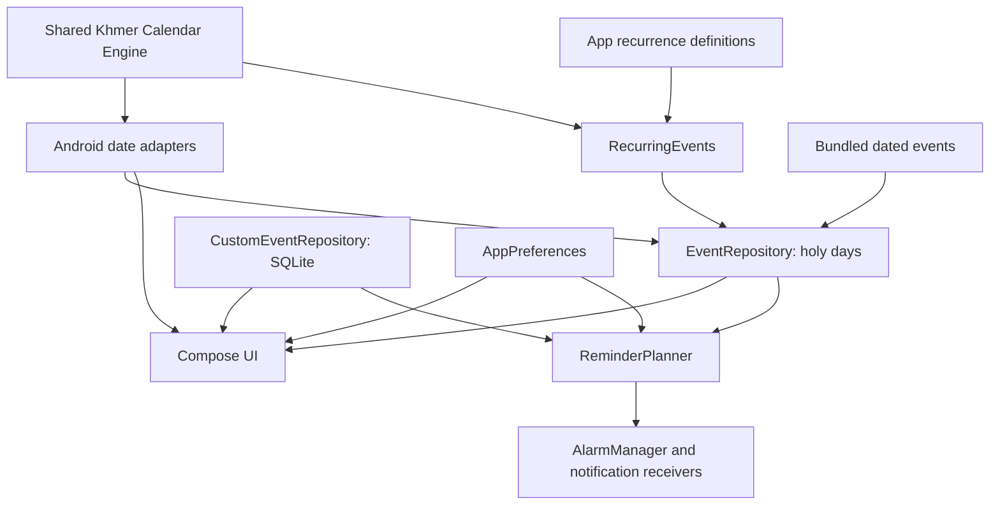

# System architecture

Khmer Calendar is an offline Kotlin/Jetpack Compose Android app. It uses a released calculation library and bundles its event data. The installed app has no Internet permission, telemetry or advertising SDKs.

## Calendar integration

The [shared engine integration guide](shared-engine.md) describes the pinned dependency, API boundary, Android adapters and upgrade checks. The engine owns lunar conversion, traditional year transitions, holy days, New Year dates and recurrence evaluation for **1800–2200**. Android owns `LocalDate` conversion, localized labels and Western zodiac presentation.

Calculation algorithms and supporting evidence are maintained in the engine project. Android tests verify that the app continues to consume its results correctly when the dependency changes.

## Events and storage

`EventRepository` selects captured records for 2000–2030 and precomputed engine recurrences for 1980–1999 and 2031–2050. Engine-derived holy days are also precomputed for 1980–2050. The committed resources are read lazily, and each requested year's localized event list is cached in memory. Years outside 1980–2050 use the engine on demand. This is an event-date cache; the calendar grid and date details still use the engine directly. User-created events come from a separate repository and are combined with built-in events by the UI and reminder planner.

| Event kind | Source |
| --- | --- |
| `HOLIDAY` | Captured occurrence with a year-specific official source URL; current anchors cover 2025–2026 |
| `OBSERVANCE` | Other captured occurrences or calculated recurrence results |
| `HOLY_DAY` | Shared engine result, precomputed for 1980–2050 and calculated on demand otherwise |
| `CUSTOM` | User-created event stored locally |

The [bundled data guide](reference-event-database.md) describes the 3,246 captured occurrences and their provenance. The [recurrence guide](recurring-event-rules.md) describes the 100 app-owned rules and their mapping to engine inputs. Engine upgrades do not replace these records or definitions.

`CustomEventRepository.kt` stores events in `custom-events.db`:

| Column | Value |
| --- | --- |
| `id` | UUID primary key |
| `title` | Event name, up to 120 characters |
| `date` | Gregorian date, `YYYY-MM-DD` |
| `time` | Scheduled time, `HH:mm` |
| `notes` | Optional description, up to 2,000 characters |
| `remind` | Reminder eligibility |
| `zone_id` | Saved IANA time zone |
| `offset_seconds` | Saved UTC offset, when available |

## Reminders and notifications

The application provides local, reliable event notifications without relying on Google Play Services, Firebase Cloud Messaging (FCM), or external background workers.

### Architecture
- **`EventReminderReceiver`** (in `notifications/EventNotifications.kt`): Broadcast receiver triggered by Android's `AlarmManager.setExactAndAllowWhileIdle` for precision alarms.
- **`ReminderRestoreReceiver`** (in `notifications/EventNotifications.kt`): Re-calculates and re-registers the next upcoming alarm upon device restart (`ACTION_BOOT_COMPLETED`), package replacement, clock adjustment (`ACTION_TIME_SET`, `ACTION_TIMEZONE_CHANGED`), or exact-alarm permission changes.
- **Single Next-Alarm Queue**:
  - Rather than filling Android's alarm table with hundreds of future alarms, the app calculates the immediate next event moment and schedules a single alarm.
  - When that alarm fires, notifications are posted, and the queue automatically schedules the subsequent alarm.

### Event-type controls

Notification settings provide separate **Push custom**, **Push holidays**, **Push observances**, and **Push Buddhist holy days** switches before **Push time**. Custom, holiday and observance choices default to on; the master notification switch and holy-day reminders default to off. Turning off **Buddhist holy days in events** hides **Push Buddhist holy days** and suppresses its reminders while preserving the saved on/off choice. Showing holy days again restores that choice. Holy-day reminders require both switches to be on. The planner applies these choices to initial reminders and repeats, and alarm delivery rechecks current settings before posting. Disabling every eligible category leaves no alarm scheduled.

Settings changes reschedule alarms only when reminder enablement, event categories, holy-day event visibility, push time, repeat interval or **Today follows** changes. Appearance and calendar display settings leave the existing alarm in place. Language changes update the channel labels; delivery reads the current language. Custom-event edits, permission changes, app resume and system restore broadcasts still refresh the next alarm.

### Time-Zone Intelligence

- **"Today Follows" Setting**:
  - `Local Time`: Follows the device's current time zone and adjusts automatically during travel or daylight saving time.
  - `Cambodia (UTC+7)`: Fixed to Phnom Penh time regardless of device location.
- **Built-in Events**: Reminders trigger at the configured daily push time in the zone selected by **Today follows**: the device's local zone or Cambodia (UTC+7). Changing this setting or the device time zone reschedules the next alarm.
- **Custom Events**: Reminders trigger at the exact instant intended in the time zone where the event was created, converting cleanly if the user switches display time zones.
- **Repeats**: Configurable periodic repeats (**Off**, 2, 4, 6, 8, or 12 hours) use elapsed hours and stop at midnight in the selected zone for built-in events, or the saved event zone for custom events. Daylight-saving gaps move a nonexistent push time forward by the gap; repeated clock times use the first occurrence for the initial reminder.

---

## UI layer

The UI is built exclusively using Jetpack Compose with Material 3 design tokens:

- **State Hoisting**: Screens and components are stateless composables driven by immutable state models (`AppSettings`, `KhmerDateDetails`, `CalendarEvent`).
- **Adaptive Scaffolding**: Detects screen dimensions, smallest width (`sw600dp`), and orientation (`ORIENTATION_LANDSCAPE`) to dynamically switch between compact phone layouts, phone landscape rails, and tablet 2-column widescreen experiences.
- **Dynamic Text Scaling**: Custom `readableSp` extension scales typography dynamically based on user-selected font scaling preferences without disrupting fixed grid geometry.
